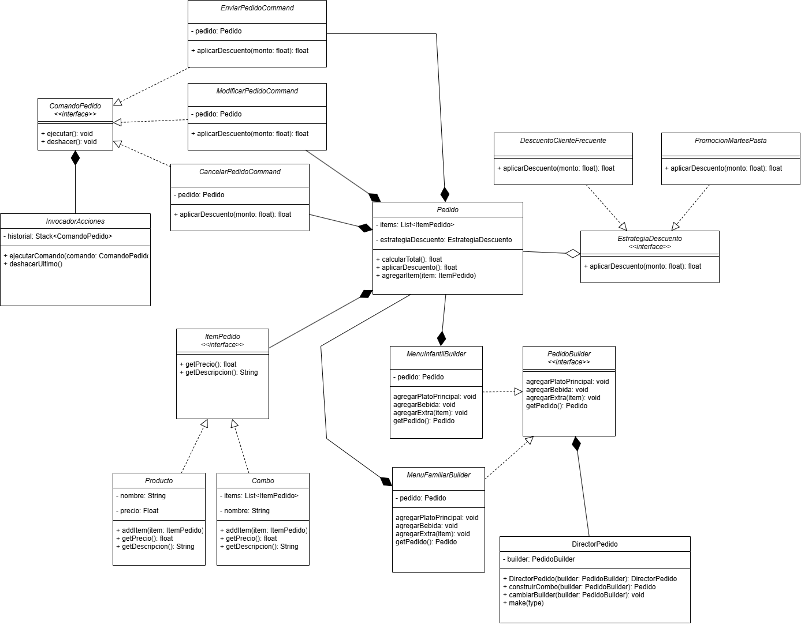

# Solucion
## Diagrama de clases

## **Patrones propuestos para la solucion**

---

### 1. Construcción flexible de pedidos
Propongo utilizar el patron builder
**¿Dónde usarlo?**  
Para construir pedidos complejos con elementos obligatorios y opcionales, así como combos predefinidos.

**Justificación:**  
Permite construir objetos `Pedido` paso a paso. El Builder puede tener métodos como `addPlatoPrincipal()`, `addBebida()`, `addExtra()`, etc. Se pueden definir Builders distintos para pedidos personalizados o combos predefinidos como "Menú Infantil", encapsulando la lógica de construcción.

---

### 2. **Strategy**

propongo usarlo para Cálculo de precios con descuentos
**¿Dónde usarlo?**  
Para encapsular distintas estrategias de descuento como `DescuentoClienteFrecuente`, `PromocionMartesPasta`, etc.

**Justificación:**  
Permite cambiar la lógica de cálculo de precios sin alterar la clase `Pedido`. Así se puede aplicar una sola estrategia en tiempo de ejecución, cumpliendo con el requisito de no acumular descuentos.

---

### 3. **Composite**
propongo usarlo para Estructura jerárquica de items del pedido

**¿Dónde usarlo?**  
Para tratar platos, bebidas, combos y extras como elementos individuales o agrupados.

**Justificación:**  
Un `Combo` puede estar compuesto por otros `ItemPedido` (como hamburguesa, bebida, juguete), y todos deben compartir una interfaz común. Así puedes tratar combos y productos individuales de la misma forma al calcular precio total, imprimir, etc.

---

### 4. **Command** — *Gestión de acciones sobre los pedidos*

**¿Dónde usarlo?**  
Para implementar acciones como "Enviar a cocina", "Cancelar", "Modificar", y permitir "deshacer".

**Justificación:**  
Encapsular cada acción como un objeto (`EnviarPedidoCommand`, `CancelarPedidoCommand`, etc.) permite ejecutar, deshacer y mantener un historial de acciones para revertir operaciones. Ideal para implementar un *undo* simple.

---
